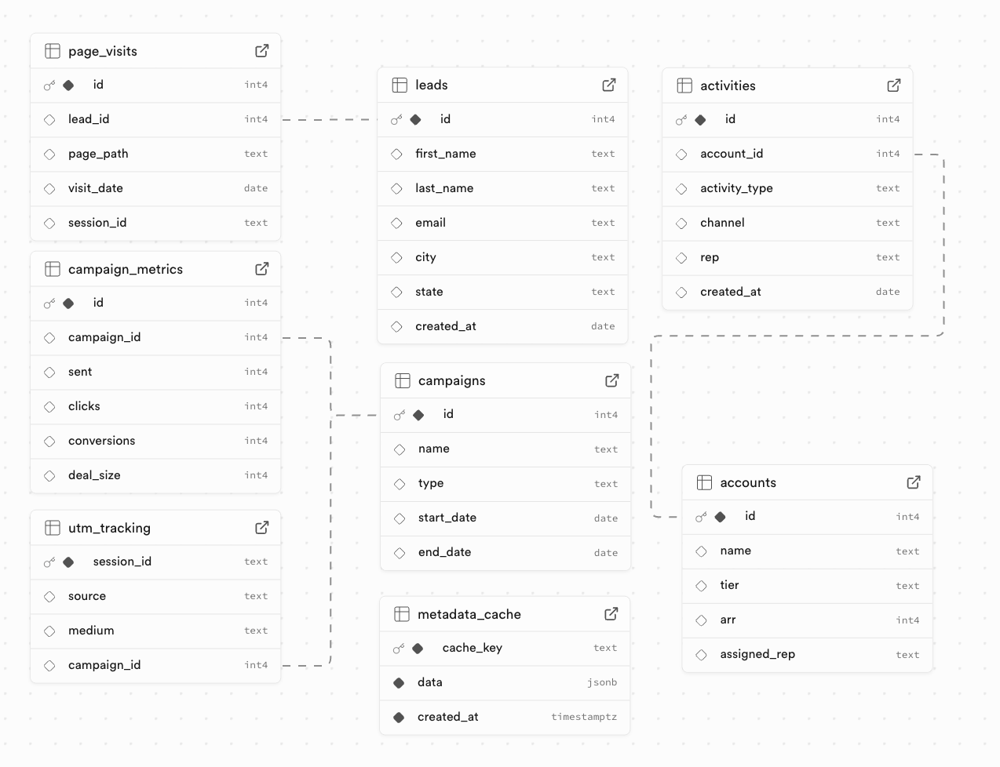

# 🧠 AI Postgres Agent

This project is an AI-powered Postgres Agent designed to help users explore and query their PostgreSQL database using natural language. Built using the [Model Context Protocol (MCP)](https://github.com/modelcontextprotocol), it uses structured tool calling, metadata caching, and SQL validation to safely run SELECT-only queries and return the results in CSV format. This readme also contains everything that you need to populate your Postgres database with some mock crm type data to test the agent with:



---

## 🛠️ Features

- ⚡ Natural language to SQL via LLM agent
- 🔧 Tool-based architecture (`@app.tool()`)
- 🧠 Metadata-aware querying (table names, types, foreign keys, example rows, low-cardinality values)
- 🧾 Caching with PostgreSQL
- 🗂️ Result export to CSV
- 🔍 Debuggable via [MCP Inspector](https://github.com/modelcontextprotocol/inspector)

---

## 🧰 Requirements

- Python 3.10+
- A PostgreSQL database
- [uv](https://github.com/astral-sh/uv) (for dependency management)
- Anthropic API key
- (Optional) A Logfire account

---

## 🚀 Getting Started

### 1. Clone the repo

```bash
git clone https://github.com/your-username/ai-postgres-agent.git
cd ai-postgres-agent
```

### Install dependencies

```bash
uv venv
source .venv/bin/activate
uv pip install -e .
```

### Set up .env

Create a .env file in the root with the following contents:

```
ANTHROPIC_API_KEY=...
PGUSER=...
PGDATABASE=...
PGHOST=...
PGPASSWORD=...
```

### PostgreSQL Setup

Make sure the specified PostgreSQL database is running and accessible.

#### Create the metadata cache table

This agent uses a PostgreSQL table to cache metadata from your database and avoid repeated introspection. Run the following SQL in your Postgres database:

```sql
CREATE TABLE metadata_cache (
    cache_key TEXT PRIMARY KEY,
    data JSONB NOT NULL,
    created_at TIMESTAMPTZ NOT NULL DEFAULT NOW()
);
```

#### (optional) Seed your database with example data

You can populate your database with realistic CRM/Marketing/Sales sample data by running the provided seed_data.py script. First you need to create the necessary tables in your database:

```sql
-- leads
CREATE TABLE leads (
    id SERIAL PRIMARY KEY,
    first_name TEXT,
    last_name TEXT,
    email TEXT,
    city TEXT,
    state TEXT,
    created_at DATE
);

-- page_visits
CREATE TABLE page_visits (
    id SERIAL PRIMARY KEY,
    lead_id INTEGER REFERENCES leads(id),
    session_id UUID,
    page_path TEXT,
    visit_date TIMESTAMP
);

-- accounts
CREATE TABLE accounts (
    id SERIAL PRIMARY KEY,
    name TEXT,
    tier TEXT,
    arr INTEGER,
    assigned_rep TEXT
);

-- activities
CREATE TABLE activities (
    id SERIAL PRIMARY KEY,
    account_id INTEGER REFERENCES accounts(id),
    activity_type TEXT,
    channel TEXT,
    rep TEXT,
    created_at TIMESTAMP
);

-- campaigns
CREATE TABLE campaigns (
    id SERIAL PRIMARY KEY,
    name TEXT,
    type TEXT,
    start_date TIMESTAMP,
    end_date TIMESTAMP
);

-- campaign_metrics
CREATE TABLE campaign_metrics (
    id SERIAL PRIMARY KEY,
    campaign_id INTEGER REFERENCES campaigns(id),
    sent INTEGER,
    clicks INTEGER,
    conversions INTEGER,
    deal_size INTEGER
);

-- utm_tracking
CREATE TABLE utm_tracking (
    id SERIAL PRIMARY KEY,
    session_id UUID,
    source TEXT,
    medium TEXT,
    campaign_id INTEGER REFERENCES campaigns(id)
);
```

Now run:

```
uv run seed_data.py
```

This will populate your tables with randomly generated data that you can test the agent against.


### Run the Agent in Dev

Now that postgres is setup and ready, let's run the agent. We will need to run the MCP server first on a docker container.

- First build the docker image:

```bash
docker build -f server/Dockerfile -t postgres-agent-server .
```

- Then run the image:

```bash
docker run -p 8000:8000 postgres-agent-server
```

Then in a separate terminal start the client. Run:

```
uv run client/main_full.py --cli --http://127.0.0.1:8000/mcp
```

Note: You can also change the --server-url if you would like the server to be run in a different location.

The terminal will now ask for you to prompt the agent. Ask a question like, "List enterprise accounts with no contact in 30+ days". The MCP client will communicate with the server through http.


### Running in Production

#### MCP Server EC2

The MCP server is running on an EC2 service currently and the project will default to point at the server for requests if you do not specify a --server-url. Sometimes the server crashes and needs to be restarted. To do that, run:

```bash
# to ssh into the server
ssh -i postgres-agent.pem ubuntu@18.191.195.92

# to restart the image
docker restart postgres-agent-server
```

To re-run the image:

```bash
# Get the image from docker hub
curl -O https://airfold-postgres-agent-config.s3.us-east-2.amazonaws.com/compose.yaml

# Run the image
docker compose up -d
```

#### Client and FastAPI

In production, this agent runs as a microservice. It can be accessed via api calls where the header must include a prompt. The functionality of main_full.py is wrapped in FastAPI so that you can send POST requests and receive the final Agent response back.

To run the client server:

```bash
uv run client/main_full.py
```

This is the same command as before but without any flags. This will default to running a uvicorn process locally.

The server in production runs on Render. Try making an api call, example:

```bash
curl -s -X POST https://airfold-postgres-agent.onrender.com/agent \
  -H "Content-Type: application/json" \
  -d '{"prompt": "Show me revenue by quarter"}'
```

### Observing the agent

There are a few observability tools built into this project that you can run to observe the agent.

#### To run mcp inspector:

```bash
npx @modelcontextprotocol/inspector uv run full_postgres_server.py
```
This will start the MCP server and open the interactive Inspector UI, allowing you to test each tool individually using real inputs and see structured responses.

#### To run Logfire:

This project uses [Logfire](https://pydantic.dev/logfire) to track tool usage, agent reasoning, and final outputs. To enable Logfire logging, dependencies should already be installed locally.

You will need to create your own logfire account [here](https://logfire.pydantic.dev/login)


 Once complete, in the virtual environment, run:

```bash
logfire auth
```

This should take you to the logfire dashboard where you can see Agent run information in real time.

